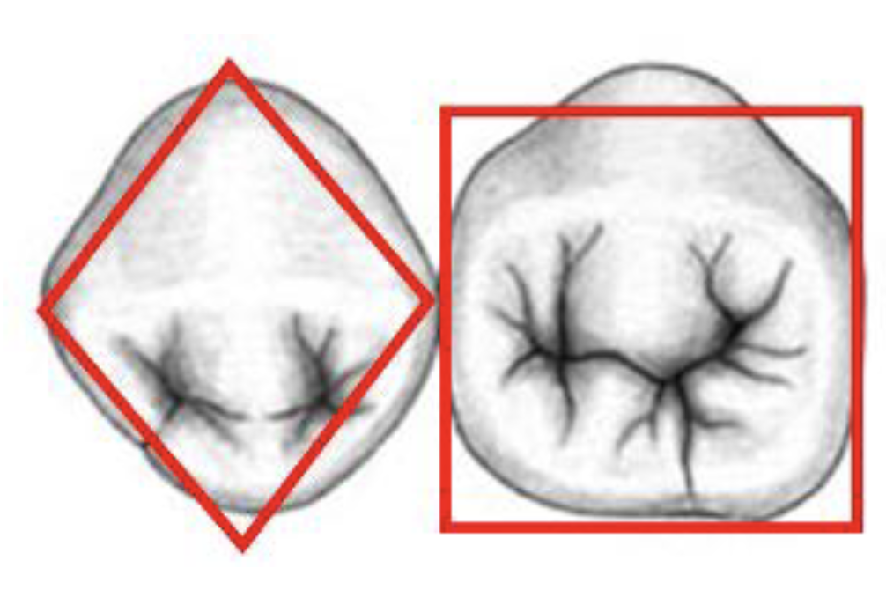

| Premolar                       | Cusp count & description                                                                                                           | Occlusal shape & groove pattern                                                                                                                                                               | Transverse ridge / central groove                                                                                           | Lingual cusp size & function                                                                                        | Buccal cusp features                                                                                                                                                                                      | Crown outline & lingual tilt                                                                                                                                                          | Proximal view & contacts                                                                                              | Root & pulp                                                                                                            | Typical measurements (averages)                                                                                                                | Clinical / restorative notes                                                                                                           | Developmental lobes                                                                                              |
|--------------------------------|------------------------------------------------------------------------------------------------------------------------------------|-----------------------------------------------------------------------------------------------------------------------------------------------------------------------------------------------|-----------------------------------------------------------------------------------------------------------------------------|---------------------------------------------------------------------------------------------------------------------|-----------------------------------------------------------------------------------------------------------------------------------------------------------------------------------------------------------|---------------------------------------------------------------------------------------------------------------------------------------------------------------------------------------|-----------------------------------------------------------------------------------------------------------------------|------------------------------------------------------------------------------------------------------------------------|------------------------------------------------------------------------------------------------------------------------------------------------|----------------------------------------------------------------------------------------------------------------------------------------|------------------------------------------------------------------------------------------------------------------|
| **Mandibular First Premolar**  | • 2 cusps: long, sharp buccal cusp and very small, nonfunctional lingual cusp (~2/3 crown height).                                 | • Diamond-shaped occlusal table.   • Mesial and distal fossae/pits ("snake eyes") common. | • Pronounced transverse ridge(s).   • Often no central groove.                                                           | • Very small lingual cusp, nonfunctional.                                                                           | • Large, pointed buccal cusp.   • Cusp tip often slightly mesial.   • Mesial cusp slope shorter than distal. | • Occlusal diamond outline.   • Pronounced lingual tilt of crown relative to root (≈45°). | • Proximal view rhomboidal.   • Clinical exception: mesial contact of mandibular 1st is more cervical than distal. | • Usually single root (may rarely bifurcate).   • 2 pulp horns (one per cusp).   • Single canal.                 | • Crown length: 9 mm.   • Root length: 15 mm.   • Overall length: 23 mm.   • Crown width (MD): 7 mm.   • Faciolingual crown: 8 mm. | • Pronounced transverse ridge + separate M & D fossae → often separate Class I restorations ("snake eyes").                            | • Not emphasized for 1st premolar.                                                                               |
| **Mandibular Second Premolar** | • 2–3 cusps: commonly 3-cusp type (1 buccal + 2 lingual) or 2-cusp type.   • Lingual cusp(s) larger/functional vs 1st premolar. | • More square/rounded occlusal outline.   • Groove patterns: Y (three-cusp), U or H (two-cusp).   • Central fossa present in 3-cusp type.                                               | • Three-cusp type: 3 triangular ridges that do NOT join to form a transverse ridge.   • Groove system forms central pit. | • Lingual cusp(s) larger and functional.   • In 3-cusp type: mesiolingual cusp usually larger than distolingual. | • Buccal cusp shorter and less sharp than 1st premolar.   • Cusp slopes more rounded.                                                                                                                  | • Occlusal outline nearer square.   • Lingual tilt present but less pronounced than 1st.                                                                                           | • Proximal view rhomboidal.   • Distal contact generally more cervical than mesial (typical premolar pattern).     | • Single root, larger/longer than 1st.   • Pulp: 3 pulp horns in 3-cusp type (or 2 in 2-cusp).   • Single canal. | • Crown length: 8 mm.   • Root length: 15 mm.   • Overall length: 22 mm.   • Crown width (MD): 7 mm.   • Faciolingual crown: 8 mm. | • 3-cusp form has central pit/fossa → requires different restorative approach.   • Less often dominated by single transverse ridge. | • 3-cusp type: 5 lobes (3 buccal + 2 lingual) — ~55%.   • 2-cusp type: 4 lobes (3 buccal + 1 lingual) — ~45%. |

- Lingual cusp is smaller
- Single root